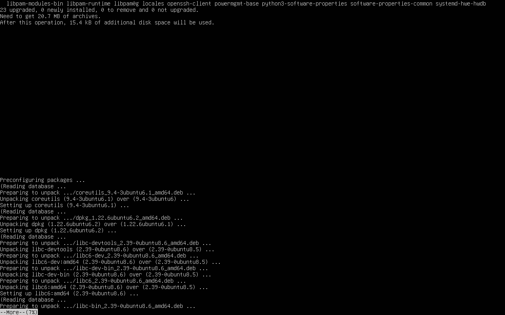
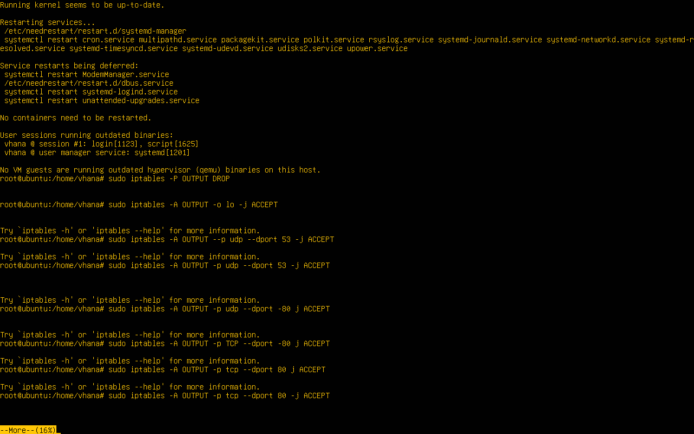
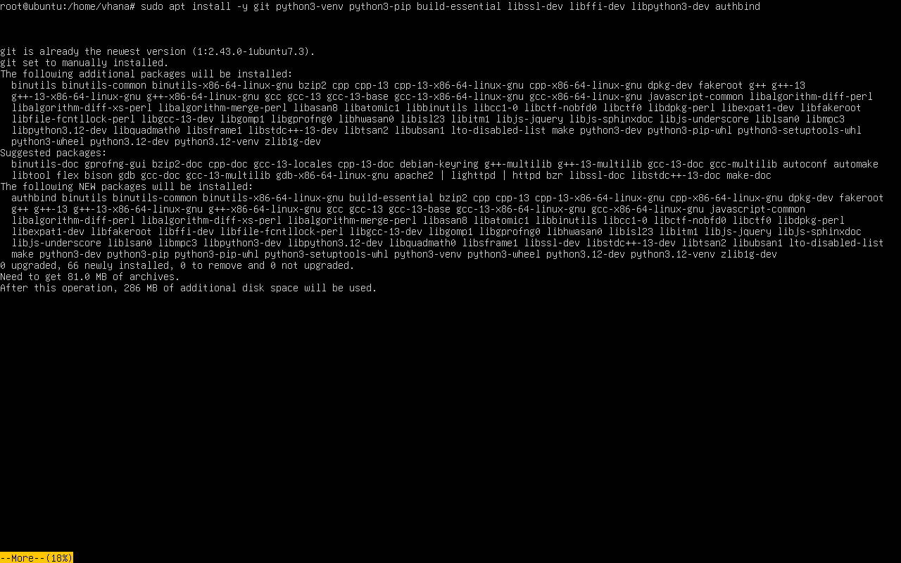
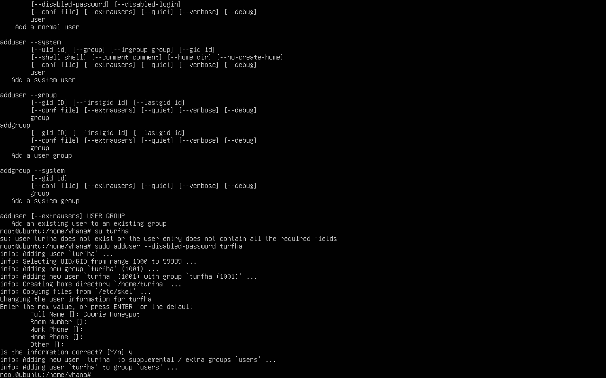
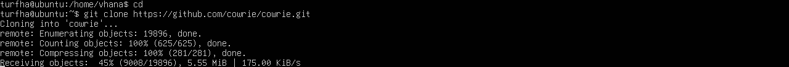
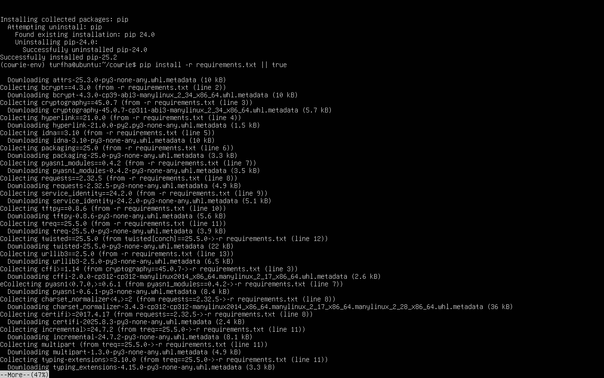
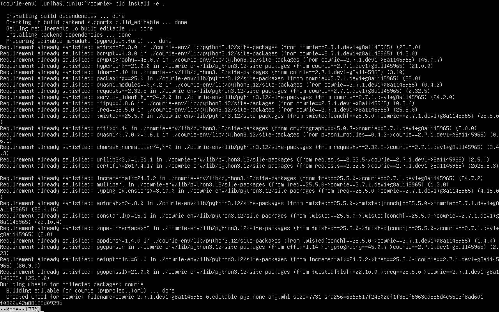
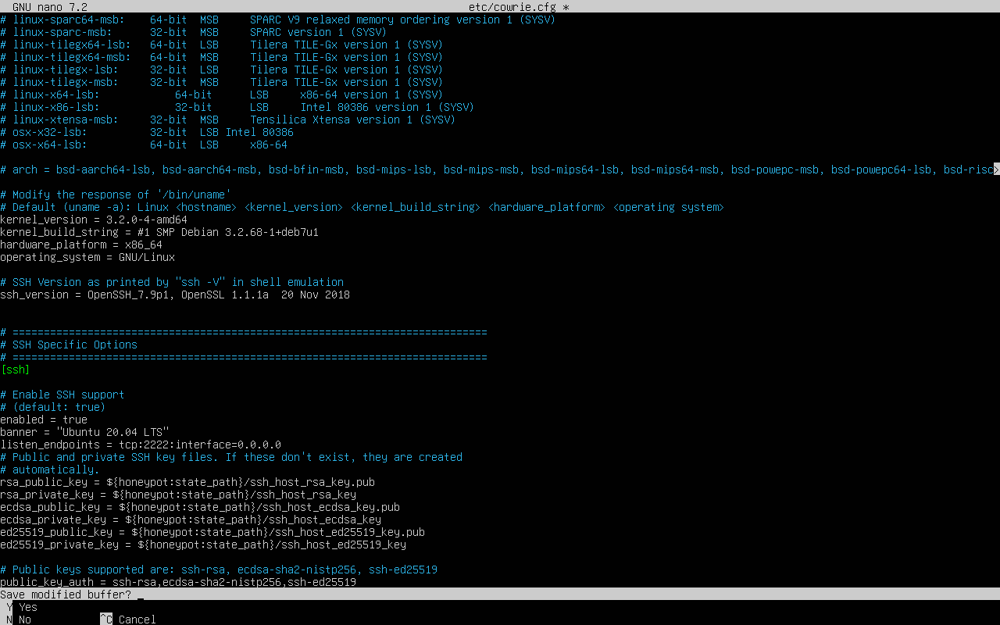
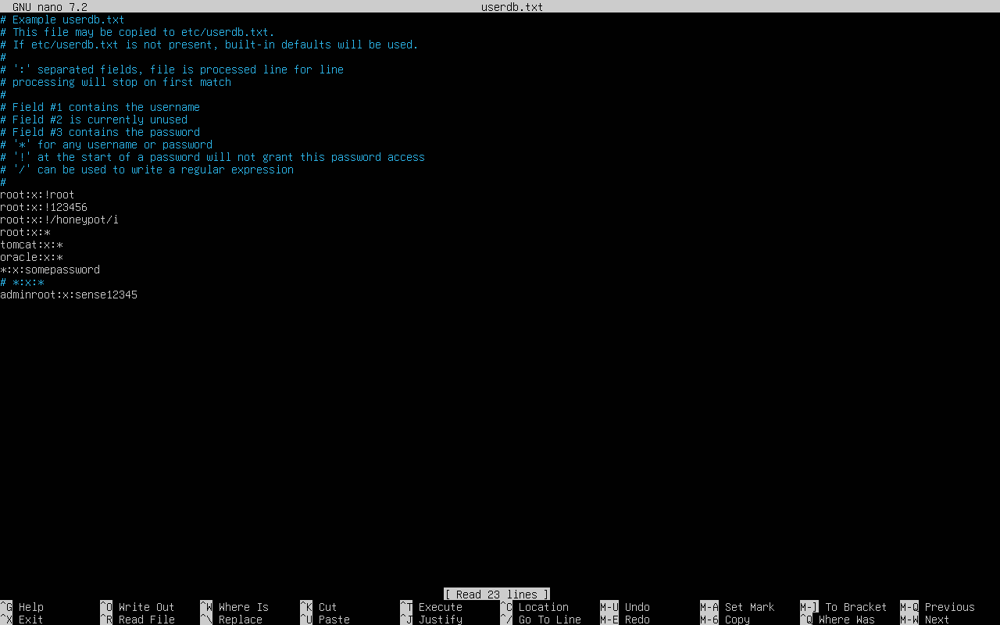

# Cowrie Honeypot Setup Guide 🛠️

This document explains how I installed and configured [Cowrie](https://github.com/cowrie/cowrie), an SSH/Telnet honeypot designed to capture attacker activity.  

---

## 1. Prerequisites

- Ubuntu 24.04.3 LTS (or similar Linux environment)  
- Python 3.10+  
- Git installed  
- Non-root user with `sudo` privileges  

📸 *Screenshot Placeholder: Upgrading and Updating System (e.g., `Sudo apt-get update && sudo apt-get upgrade -y`)*  
  

---

## 2. Update Firewall Rules

Before running Cowrie, configure the firewall to allow necessary outbound and loopback traffic. Example using `iptables`:
```bash
# Default policy: drop all outgoing traffic
sudo iptables -P OUTPUT DROP

# Allow loopback interface
sudo iptables -A OUTPUT -o lo -j ACCEPT

# Allow established and related connections (conntrack)
sudo iptables -A OUTPUT -m conntrack --ctstate ESTABLISHED,RELATED -j ACCEPT

# Allow DNS (UDP port 53)
sudo iptables -A OUTPUT -p udp --dport 53 -j ACCEPT

# Allow HTTP (TCP port 80) and HTTPS (TCP port 443)
sudo iptables -A OUTPUT -p tcp --dport 80 -j ACCEPT
sudo iptables -A OUTPUT -p tcp --dport 443 -j ACCEPT
```
📸 *Screenshot Placeholder: Updating Firewall Rules


## 3. Install Dependencies

Cowrie requires several packages and libraries. I Installed them using:

```bash
sudo apt install -y git python3-venv python3-pip build-essential libssl-dev libffi-dev libpython3-dev authbind

```
📸 *Screenshot Placeholder: Intsalled Dependencies


## 4. Create a Non-root User With Sudo Privileges
This minimizes the attack surface by isolating cowrie to that user. 
```bash
sudo adduser --disabled-password <user>
```
📸 *Screenshot Placeholder: Add a Non-root User


## 5. Clone the Cowrie Repository

With the non-root user created, the next step is to clone the official [Cowrie repository](https://github.com/cowrie/cowrie) from GitHub.  

Switch to the non-root user (replace `cowrie` with the username you created):  
```bash
sudo su - cowrie
```
Then clone the repository:
```bash
git clone https://github.com/cowrie/cowrie.git
cd cowrie
```

📸 *Screenshot Placeholder: Cloned Cowrie from Github


## 6. Set Up Python Virtual Environment

Cowrie is written in Python, so it’s best practice to run it inside a virtual environment.  
This keeps Cowrie’s dependencies isolated from the system Python environment.

From inside the `cowrie` directory:  

```bash
# This is to ensure I am inside the cloned repository
cd ~/cowrie

# I created a virtual environment
python3 -m venv cowrie-env

# I activated the virtual environment
source cowrie-env/bin/activate
# I installed dependencies and upgraded to the pip lastest version
pip install --upgrade pip
pip install -r requirements.txt || true
```
📸 *Screenshot Placeholder: Installing Cowrie Dependencies and Setting up Virtual Environment


## 7. Install Cowrie in Editable Mode

With the virtual environment activated and dependencies installed, the next step is to install Cowrie in editable mode.  
This allows one to make changes to the Cowrie source code and run it without needing to reinstall.  

Run:  
```bash
pip install -e .
```
📸 Screenshot Placeholder: Installing Cowrie in Editable Mode


## 8. Configure Cowrie

Before starting Cowrie, one needs to set up its configuration file.  
Cowrie provides a sample configuration file called `cowrie.cfg.dist`.  
One should make a copy of this file and rename it to `cowrie.cfg`.  

From inside the `cowrie` directory:  

```bash
cd ~/cowrie

# Copy the sample config file
cp etc/cowrie.cfg.dist etc/cowrie.cfg
```
I could now edit the new config file to customize the cowrie honeypot. For example:
```bash
nano etc/cowrie.cfg
```
Key settings one may want to review:
hostname → change the fake system hostname attackers will see.
listen_endpoints → configure which ports Cowrie listens on (default is SSH on port 2222, not 22).
📸 Screenshot Placeholder: Editing Cowrie Config File


## 9. Customize Fake Credentials

Cowrie ships with a sample credentials file `userdb.example`. Create the actual `userdb.txt` from the example and edit it to define fake usernames/passwords that attackers can use to successfully log into the honeypot.

From inside the `cowrie` directory run:
```bash
# Copy the example to create the editable userdb
cp etc/userdb.example etc/userdb.txt
```
Open userdb.txt with the text editor:
```bash
nano etc/userdb.txt
```
📸 Screenshot Placeholder: Editing Cowrie Userdb File


## 10. Start Cowrie
switch to the user you created in Step 4 above
```bash
sudo -u <user> -H bash
# activate venv and start
cd ~/cowrie
source cowrie-env/bin/activate
bin/cowrie start
```
📸 Screenshot Placeholder: Starting Cowrie


## 11. Test Cowrie and View Logs


