## 1 — Introduction
This document is a complete, step-by-step walkthrough of my investigation of the **Rhino Hunt** challenge dataset (USB image + network traces).  
Environment: **Windows host** (file prep) + **SIFT VM** (analysis).

## 2 — Files provided
- `RHINOUSB.dd` — USB image
- `rhino.log`, `rhino2.log`, `rhino3.log` — network trace files
## 3 — Tools & versions used
- Windows 11 — copying/sharing files to VM  
- **SIFT VM** — primary analysis environment  
- `foremost` — file carving (JPEG recovery)  
- `Wireshark` — network analysis (.log inspection)  
- `John the Ripper` — password cracking (when needed)  
- `stegdetect`, `stegbreak` — steganalysis & brute force on stego images  
- `jpseek`, `jphide` — JPEG steganography tools / verification  
- `md5sum`/`sha1sum` for integrity verification)

## 4 — Evidence preparation (Windows → SIFT VM)
1. Copy the image and log files from Windows to a shared folder accessible by the SIFT VM 
2. On SIFT VM, verify file integrity (if hashes provided):
   ```bash
   md5sum RHINOUSB.dd
   md5sum rhino.log rhino2.log rhino3.log
   ```
    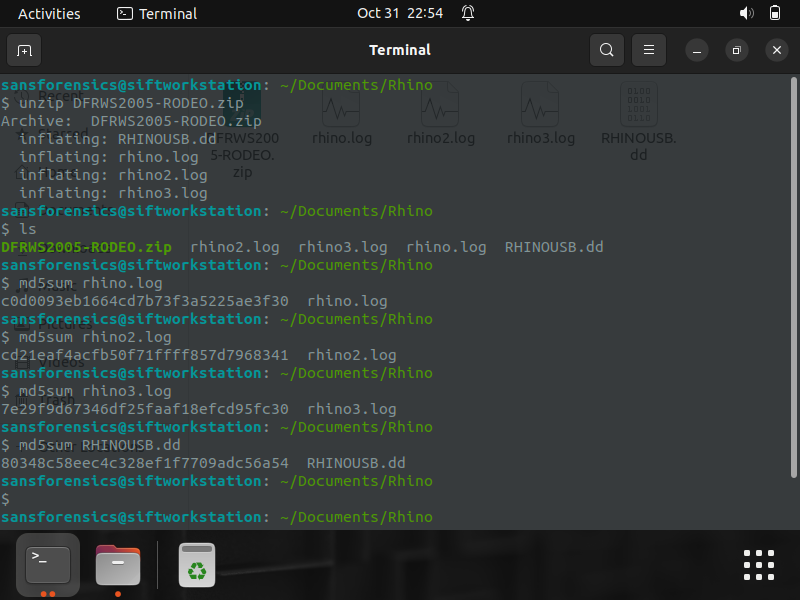

## 5 — Step-by-step analysis (what I did)
5.2 Carve images with foremost
```bash
foremost -i RHINOUSB.dd  -t jpg,gif,png
```
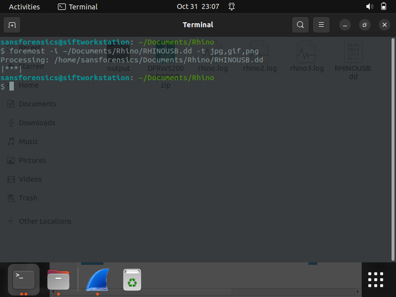

5.3 Inspected the recovered files, including docs,gif and jpg.


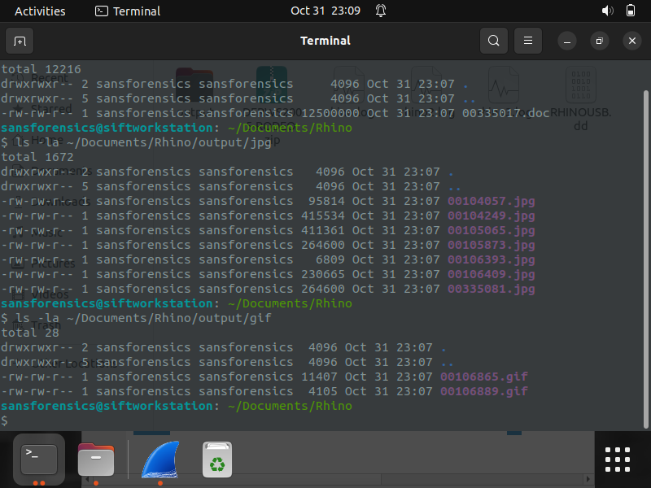 | 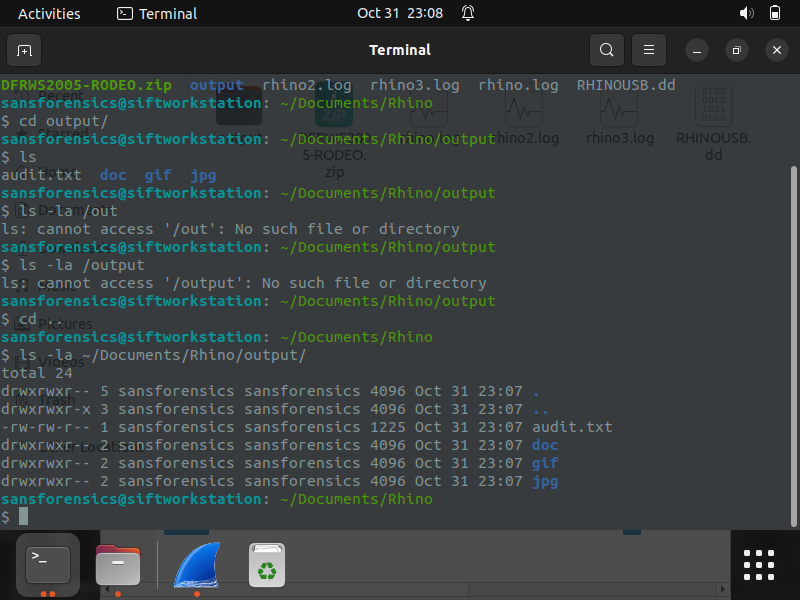 


I read the diary and I got a lead on what transpired, then I went through the network logs


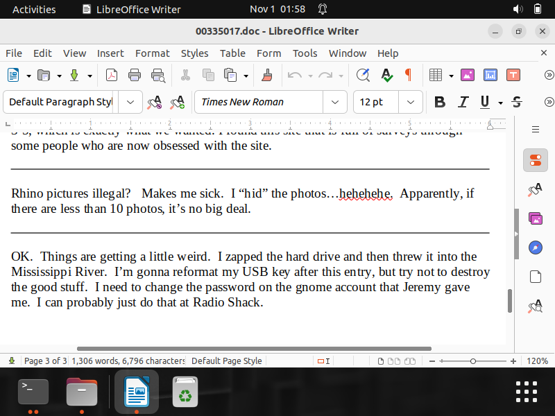

5.4 Network trace analysis with Wireshark

I opened rhino.log. I used the filter "tcp.port == 21". Then I found the FTP traffic where i retrieved the first rhino image using these steps
```bash
a. tcp.port == 21 
b. follow the stream
c. multiply the penultimate number by 256 and add the last number to it e.g 6*256 + 121 = 1657
d. do tcp.port == 1657
e. follow the stream and save the raw format
f. you would get back the original image/file that was transferred over the network
```

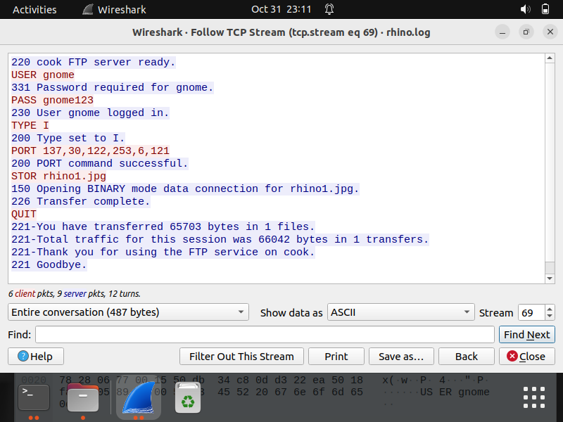 | 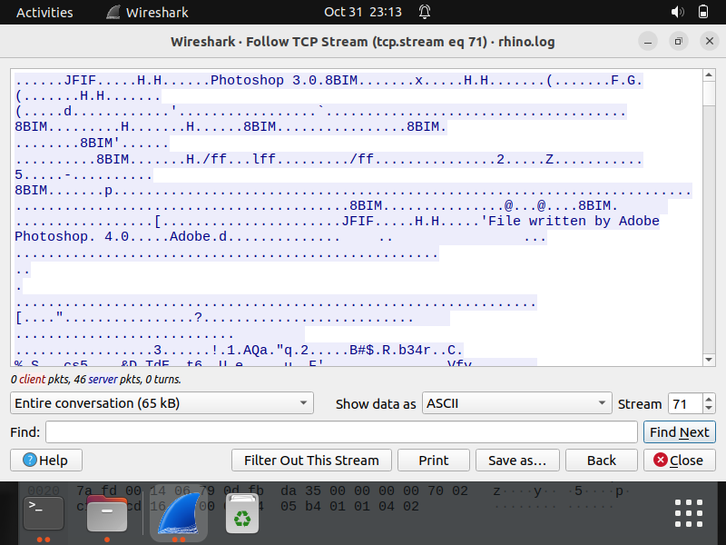 | 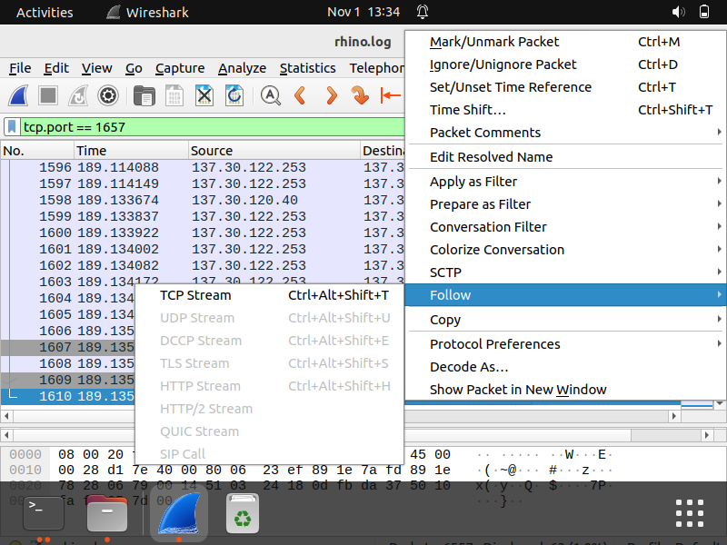

```bash
I retrieved the third rhino image using these steps
a. tcp.port == 21 
b. follow the stream
c. multiply the penultimate number by 256 and add the last number to it e.g 6*256 + 124 = 1660
d. do tcp.port == 1660
e. follow the stream and save the raw format
f. you would get back the original image/file that was transferred over the network

```
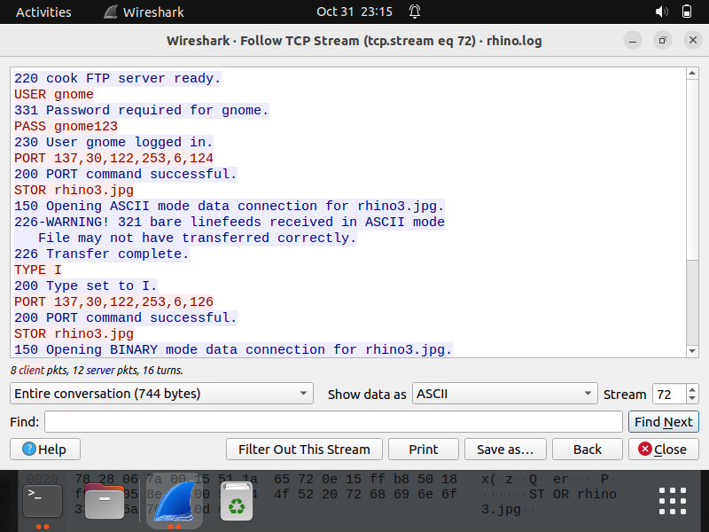 | 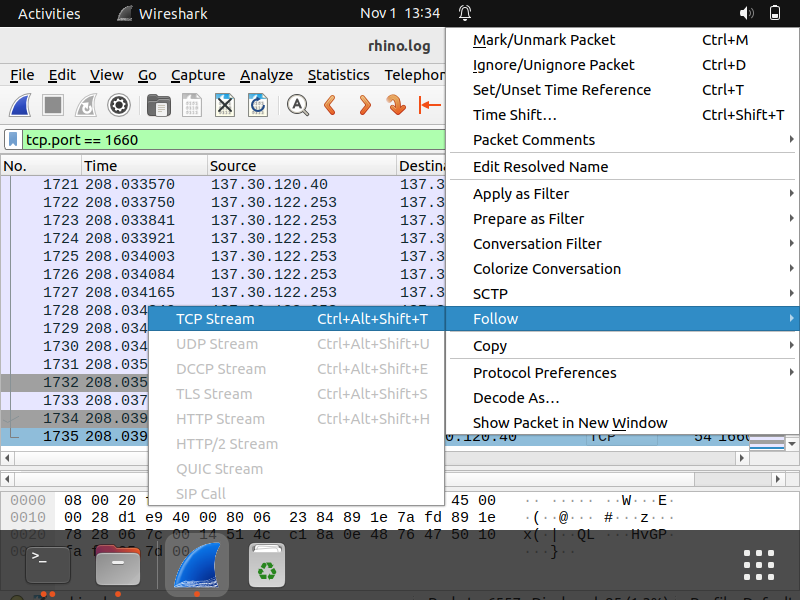 | 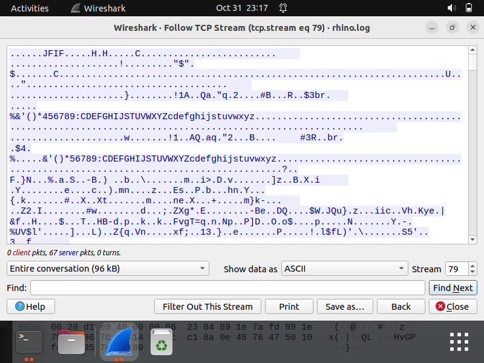

```bash
I retrieved the zip file using these steps
a. tcp.port == 21 
b. follow the stream
c. multiply the penultimate number by 256 and add the last number to it e.g 7*256 + 210 = 2002
d. do tcp.port == 2002
e. follow the stream and save the raw format
f. you would get back the original image/file that was transferred over the network

```
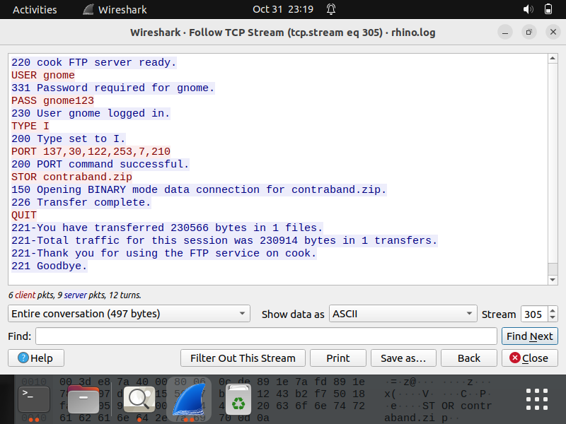 | 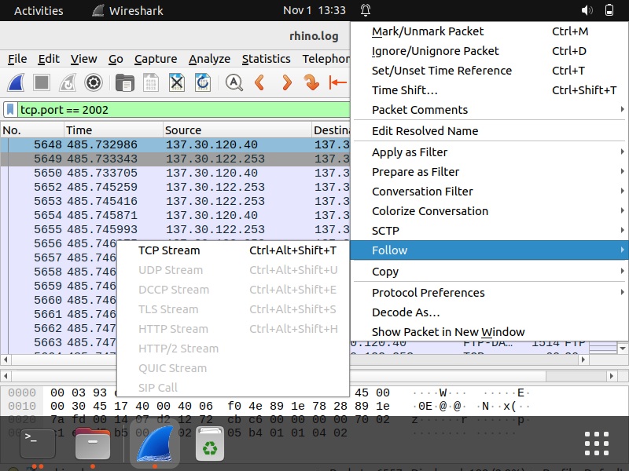 | 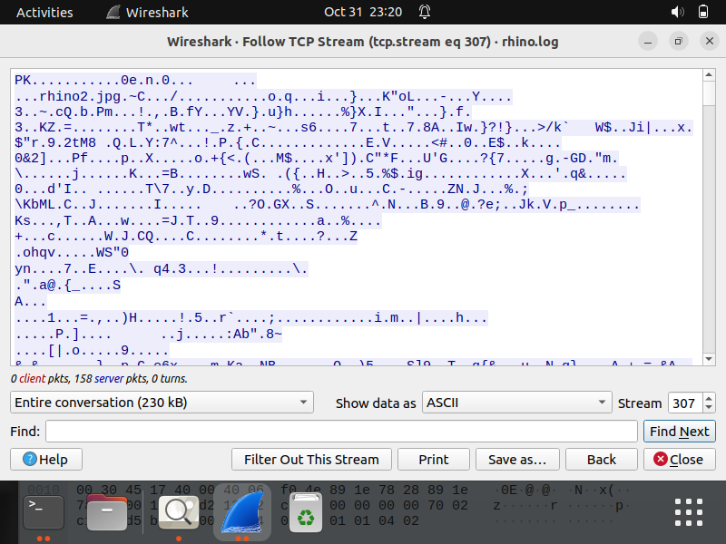


I opened rhino2.log. I traffic where I used the "export HTTP object traffic" option on Wireshark. Then, I retrieved the fourth and fifth rhino images. 

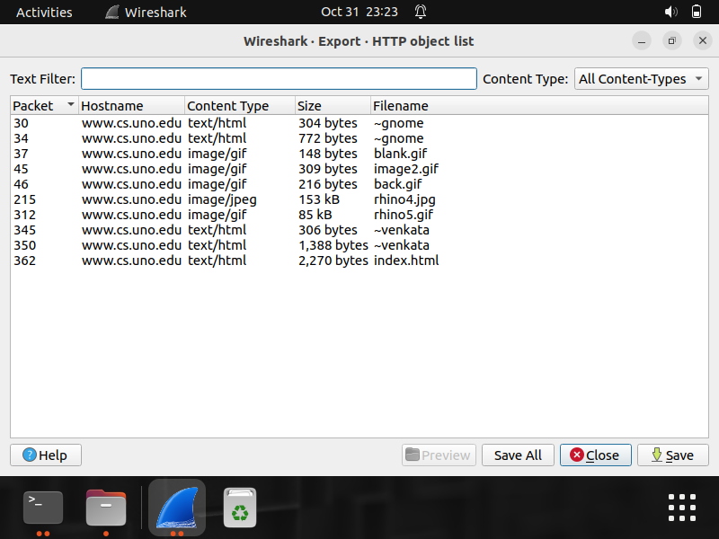 

Similarly, I opened rhino3.log. I traffic where I comibned the "export HTTP object traffic" option and "http.request" filter on Wireshark. Then, I retrieved the rhino.exe app and verified the md5sum for further analysis. 

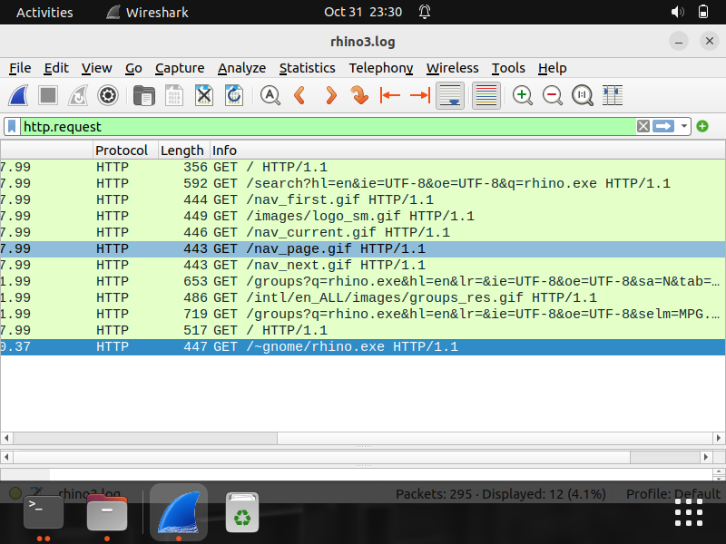 | 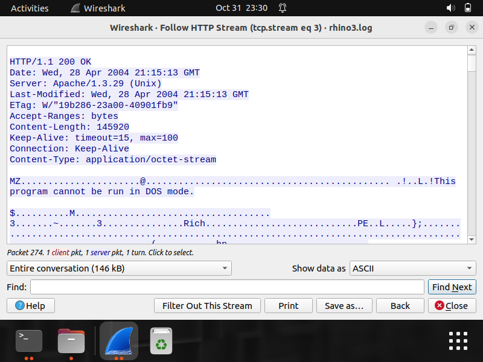 | 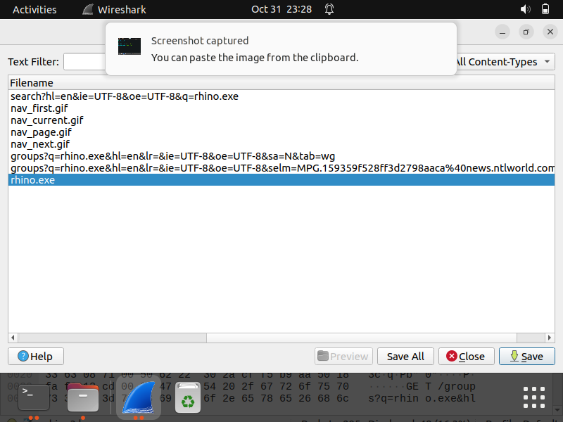 | 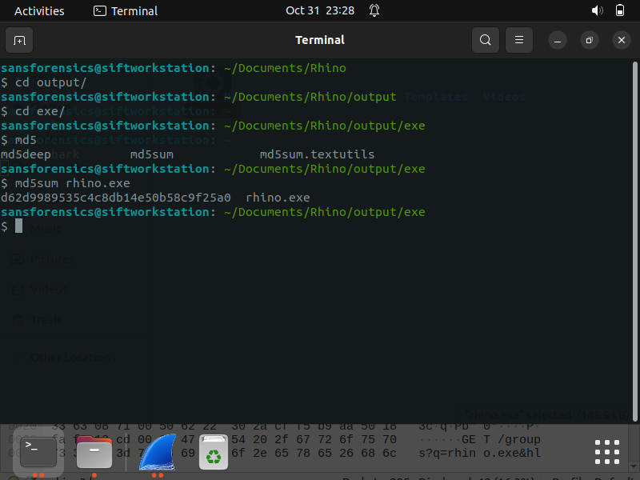


5.4### ZIP File Retrieved via Wireshark
After analysing the rhino.log file using Wireshark.  I found a ZIP file named "contraband" among the recovered files. When I tried to open it I was prompted for a password.
**Steps I took**
1. I converted the ZIP to a crackable hash with zip2john and saved the output hash to another file
   ```bash
   john-the-ripper.zip2john contraband.zip > contraband.hash
   ```
2. I cracked the hash with john using the rockyou.txt wordlist:
   ```bash
   john-the-ripper --wordlist=/usr/share/wordlists/rockyou.txt contraband.hash
   ```
3. I used the recovered password to unzip the file and extracted rhino2.jpg:
   ```bash
   unzip -P <password> contraband.zip
   ```
4 I verified rhino2.jpg matched an image recovered earlier by foremost (visual match, and by hash).

 | 

